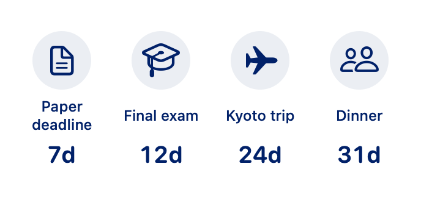

# Count Down

Keep your next event in your Mac’s menu bar, with a clean white and navy design.

**`Paper deadline · 7d`** — click the countdown to see your events, add a new one, or choose what stays in the menu bar.

Count Down supports events you create yourself, copies imported from Apple Calendar, and desktop widgets showing up to four countdowns. Everything is saved on your Mac; no account is needed.

Free to use, modify, and share for noncommercial purposes under the [PolyForm Noncommercial license](LICENSE.md).

[Install](#install) · [Add an event](#add-an-event) · [Pin an event](#choose-the-menu-bar-event) · [Desktop widgets](#add-a-desktop-widget) · [Troubleshooting](#troubleshooting)

## Install

Already installed? Open **Count Down** from your Applications folder, then click its countdown in the menu bar. With no events yet, it shows an hourglass.

The app requires **macOS 14 or later**. To build it, install the **full Xcode app, version 16 or later**, on a Mac supported by that Xcode version. Open Xcode once and complete its first-launch setup. Command Line Tools alone are not enough to build the widget.

In Terminal, run:

```sh
git clone https://github.com/datou0718/CountDown.git
cd CountDown
make run
```

This builds the app, installs it at `~/Applications/Count Down.app`, and opens it. A paid Apple Developer account is not required for this local build.

The build uses your Mac's architecture and includes the widget, icon, and license. It needs no API keys, account setup, third-party packages, or changes to bundle identifiers. To run the tests and check the packaged app before installing, run `make check`.

**This is a source installation.** The build creates an app signed for local use; it is not a notarized download for other Macs. For sharing a prebuilt app, see the [distribution notes](docs/DEVELOPMENT.md#distribution).

Count Down lives in the menu bar. To have it open automatically after signing in, click the countdown → **gear icon** → turn on **Launch at login**.

## Add an event

1. Click the countdown in the menu bar.
2. Click **New event**.
3. Enter a name, **Due date**, and **Due time**. Turn on **All day** if you only need a date.
4. Click the **time zone** control to search for a city or zone, such as `America/New_York` or `Asia/Taipei`. Changing the zone keeps the date and time you entered and adjusts the deadline accordingly. Daylight-saving offsets are calculated for the due date.
5. Choose a category, then click **Create countdown**.

| Category | Icon |
| --- | --- |
| Research | Paper |
| School | Graduation cap |
| Travel | Airplane |
| Love | Heart |
| Friend | Two people |

Each event card has three buttons in a vertical column: **pin**, **pencil** to edit, and **trash** to delete. You can also click the event name to edit it. Delete asks for confirmation.

## Choose the menu bar event

By default, Count Down shows the **nearest upcoming event**. There is always one menu bar entry, showing the event name and countdown.

- Click an event’s **pin** to keep that event in the menu bar.
- Pin a different event to switch to it.
- Click the filled pin again, or choose **Use automatic**, to return to the nearest upcoming event.
- You can also choose an event under **gear icon → Menu bar event**.

Pinning does not move the open panel. It stays directly below the menu bar, without an arrow or gap.

Timed events disappear from the list, menu bar, and widgets when their due time arrives. If a pinned event expires, Count Down automatically switches to the next upcoming event. When none remain, the menu bar shows the hourglass again. Expired events are hidden from active displays; their saved records are retained.

All-day events show **Today** on their date and disappear at midnight at the end of that date in their selected time zone. The app and live widget timer use the same whole-second rounding, with app updates aligned to the clock. Existing events keep their original deadline; select a time zone when editing to store it explicitly.

For a shorter menu bar label, turn off **Event names in menu bar** in settings. Hold **Command** and drag the menu bar entry to move it elsewhere along the bar.

## Import from Apple Calendar

1. Click **From Calendar**.
2. Click **Connect Apple Calendar** and allow access when macOS asks.
3. Search or browse events in the next 12 months.
4. Select the events you want, then click **Add countdowns**.

Imports are **separate copies**. Later changes in Apple Calendar do not sync to Count Down, and editing or deleting a countdown does not change your original calendar event. Events already imported are marked **Already added**.

Count Down only reads your calendars. macOS calls the permission “Full Access” because that is the EventKit permission required to read events.

## Add a desktop widget

1. Right-click an empty area of your desktop.
2. Choose **Edit Widgets**.
3. Search for **Count Down**.
4. Add a **small** or **medium** widget, then finish editing.

Both sizes show **up to four saved events**, with each event’s category icon, name, and countdown. Small uses a 2×2 grid; medium uses four columns. If you have two events, the widget shows two.

Your pinned event appears first, followed by the nearest upcoming events. Expired events are omitted. Click the widget to open Count Down. You can also add it to Notification Center.



*Example using sample events. The widget uses your own saved events after you add it.*

The widget remains available when the app is closed. Changes request a refresh, but macOS controls when that refresh appears. Timed events more than a day away show whole days; shorter timed events use a live timer.

## Keyboard shortcuts

Use these while the Count Down panel is active:

| Shortcut | Action |
| --- | --- |
| **⌘ N** | Add an event from the main screen |
| **⌘ ,** | Open settings |
| **Escape** | Return to the main screen, or close the panel from there |
| **⌘ Q** | Quit Count Down |

Clicking outside the panel also closes it.

## Update

Quit Count Down using **gear icon → Quit Count Down**, then run these commands from your cloned repository:

```sh
git pull --ff-only
make run
```

Your events and preferences are kept separately from the app and survive updates. The installer updates the existing app and restarts its widget helper so an old widget layout does not remain running.

## Troubleshooting

| Problem | What to do |
| --- | --- |
| Nothing appears after opening the app | Look in the **menu bar**, not the Dock. With no events, look for the hourglass. On a crowded menu bar, make room by moving other items. |
| The wrong event is in the menu bar | Check whether an event is pinned. Choose **Use automatic** to show the nearest upcoming event again. |
| The widget is missing | Open the installed app at `~/Applications/Count Down.app` once, then reopen **Edit Widgets** and search for **Count Down**. |
| The widget has fewer than four events | It shows only unexpired events you have saved. Add more events in the app. |
| The widget has old content after an update | Quit the app and run `make run` from the repository. If needed, remove and add the widget again. |
| Calendar access is off | Enable Count Down in **System Settings → Privacy & Security → Calendars**, then choose **Try again** in the app. |
| Launch at login needs approval | Use **Approve in Login Items settings** in Count Down’s settings. |
| The build says Xcode is required | Install the full Xcode app and open it once. If it is in a custom location, see the [developer guide](docs/DEVELOPMENT.md#toolchain). |
| Installation says Count Down is running | Quit it from its settings or press **⌘ Q** while its panel is active, then run `make run` again. |

## Back up your events

Your events and pin settings are stored in:

```text
~/Library/Application Support/CountDown/events.json
```

To find the file, open Finder, press **⇧⌘G**, and paste the folder path above without `events.json`. Copy the file somewhere safe. To restore it, quit Count Down, replace the file with your backup, and reopen the app.

If the file cannot be read, Count Down leaves it untouched and pauses saving so you can restore a backup.

## For developers

Run `make check` for tests, a release build, and bundle checks. GitHub Actions runs the same command on a clean macOS runner for pushes and pull requests. See the [developer guide](docs/DEVELOPMENT.md) for the code layout, widget integration, previews, and verification steps, and the [changelog](CHANGELOG.md) for recent changes.

## License

Count Down is source available under the [PolyForm Noncommercial License 1.0.0](LICENSE.md). You may use, modify, and redistribute it for purposes permitted by that license. Commercial use is not permitted by this license. Keep the license and [required notice](NOTICE) when sharing copies.
